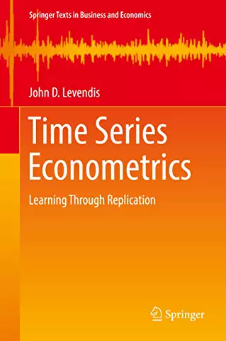

::: {layout="[30,70]"}
{fig-alt="Cover of Time Series Econometrics: Learning Through Replication, Second Edition"}

**Time Series Econometrics: Learning Through Replication**  
*Springer Texts in Business and Economics*  
Second Edition, 2023 | First Edition, 2018  
Springer International Publishing | 488 pages  

[Springer](https://link.springer.com/book/10.1007/978-3-031-37310-7) | 
[Amazon](https://www.amazon.com/dp/303137309X)
:::

This textbook teaches time series econometrics through replication rather 
than theorem and proof. Students work through landmark papers in economics 
and finance — by Granger and Newbold, Nelson and Plosser, Perron, 
Bollerslev, Sims, Arellano and Bond, and others — using the original data 
and reproducing published results in Stata. Topics progress from univariate 
ARMA models through unit root testing, structural breaks, ARCH/GARCH models, 
vector autoregressions, and static and dynamic panel data models. The book 
includes many worked examples and data-driven exercises, and is intended 
for graduate students, advanced undergraduates, and practitioners.

> "Learning by doing. This is the ethos of this book. It provides numerous 
> worked out examples along with basic concepts — a fresh, no-nonsense, 
> practical approach that students will love."  
> — Professor Sokbae "Simon" Lee, Columbia University; Co-Editor, 
> *Econometric Theory*; Associate Editor, *Econometrics Journal*

## Supplementary Materials

[Data](https://github.com/jlevendi/Time-Series-Econometrics/raw/master/book%20data%20for%20distribution.zip) | 
[Stata Do-Files](https://github.com/jlevendi/Time-Series-Econometrics/raw/master/book%20do%20files%20for%20distribution.zip) | 
[GitHub Repository](https://github.com/jlevendi/Time-Series-Econometrics)